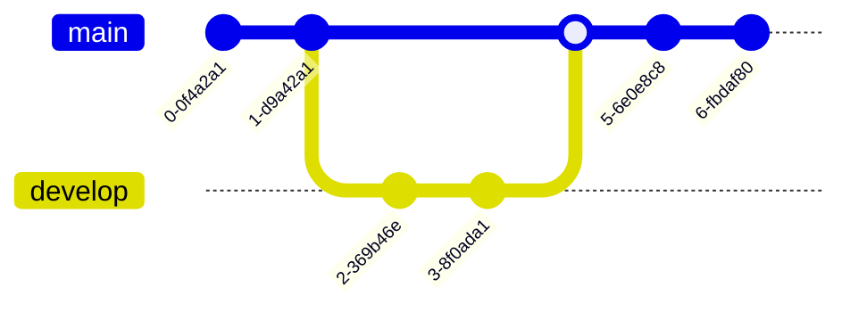

## Rashard Kelly 
MRO JUNO iSS [_ECOSTRESS_](https://ecostress.jpl.nasa.gov/gallerylist) [ALt - github.com/kellyrashardiman/kellyrashardiman.github.io](https://github.com/kellyrashardiman/kellyrashardiman.github.io/tree/master) + [homepage alt - kellyrashardiman.github.io](https://kellyrashardiman.github.io/) . . . @ucla hi from [Remote @Nasa-JPL](https://holetoanotheruniverse40.github.io/compiling/) 


<picture itemprop="productionCompany" itemtype="https://schema.org/Organization">
  
  <source src="https://ecostress.jpl.nasa.gov/logo.png" type="image/png" />
  <source src="https://github.com/user-attachments/assets/ca25b7f2-76f1-42b6-8882-9d0f09fc6363" type="image/png" />
  
  
</picture>

[https://www.onlinegdb.com/online_bash_shell](https://www.onlinegdb.com/online_bash_shell)


[mermaid.ai/open-source/syntax/examples.html#a-commit-flow-diagram](https://mermaid.ai/open-source/syntax/examples.html#a-commit-flow-diagram) 

<div class="mermaid">
gitGraph:
    commit "Ashish"
    branch newbranch
    checkout newbranch
    commit id:"1111"
    commit tag:"test"
    checkout main
    commit type: HIGHLIGHT
    commit
    merge newbranch
    commit
    branch b2
    commit
</div>




[Queen Latifah Opens Up About a Private Battle - Red Table Talk @foratlanta](https://www.youtube.com/watch?v=vgn4y83wXJg)


# HTML
[HTML Living Standard](https://html.spec.whatwg.org/multipage/) — Last Updated 3 July 2026 [@mdn](https://github.com/mdn)
[ColorNAmes - w3schools.com](https://www.w3schools.com/tags/ref_colornames.asp)
[https://fonts.google.com/](https://fonts.google.com/) @adobe i hope u guys are ok [I was looking for kuler.adobe.com/ functionality](http://web.archive.org/web/20250212005944/https://kuler.adobe.com/) and i know abt [color.adobe.com](color.adobe.com) for making swatches but the hex values are missing like the tool was downgraded and ad poisoned and i know that can be a sign of cyber attack @cisagov @fbicyber @nasa-jpl @whitehouse @deptofwar [color.adobe.com](https://color.adobe.com/) 


<div class="tupperware" markdown="1">
	
[<video controls src="https://archive.org/download/longbeach_202605/000_SPACEBEACH_GoogleFontInstallForVirtiservBaeLAtriceRecording%202026-07-03%20121238.mp4" />](https://archive.org/download/longbeach_202605/000_SPACEBEACH_GoogleFontInstallForVirtiservBaeLAtriceRecording%202026-07-03%20121238.mp4)

[<video controls src="https://archive.org/download/vid-20260411-163609-170/BuiltInWebFontsForSLoadingSpeedAndReducedVurnalbility_VirtiserLanaLatriceHArissKarenBASSRecording%202026-07-03%20SPACEBEACH_WEB_DEV_Rex152229.mp4" />](https://archive.org/download/vid-20260411-163609-170/BuiltInWebFontsForSLoadingSpeedAndReducedVurnalbility_VirtiserLanaLatriceHArissKarenBASSRecording%202026-07-03%20SPACEBEACH_WEB_DEV_Rex152229.mp4)

</div>

[codepen.io/_`RashardKElly`_/pen/jEyaRGj](https://codepen.io/RashardKElly/pen/jEyaRGj)
[codepen.io/thakarashard/pen/LYdgvbd](https://codepen.io/thakarashard/pen/LYdgvbd)


[ codepen.io/thakarashard/pen/XWExReO](https://codepen.io/thakarashard/pen/XWExReO)


[codepen.io/thakarashard/pen/yLKxPXy](https://codepen.io/thakarashard/pen/yLKxPXy)


Writing Mathematics for MathJax        
[@blackgirlscode @nasa-pds](https://github.com/mathjax/MathJax-demos-web)
github.com/mathjax/MathJax-docs _MathJax documentation. Beautiful math in all browsers. Beautifully documented._ @la-county-isd 

 
<p>
  When $a \ne 0$, there are two solutions to \(ax^2 + bx + c = 0\) and they are
  $$x = {-b \pm \sqrt{b^2-4ac} \over 2a}.$$
</p>

<h2>The Lorenz Equations</h2>

<p>
  \begin{align}
    \dot{x} & = \sigma(y-x) \\
    \dot{y} & = \rho x - y - xz \\
    \dot{z} & = -\beta z + xy
  \end{align}
</p>

<h2>The Cauchy-Schwarz Inequality</h2>

<p>\[
  \left( \sum_{k=1}^n a_k b_k \right)^{\!\!2} \leq
  \left( \sum_{k=1}^n a_k^2 \right) \left( \sum_{k=1}^n b_k^2 \right)
 \]</p>

 <h2>A Cross Product Formula</h2>

 <p>\[
   \mathbf{V}_1 \times \mathbf{V}_2 =
     \begin{vmatrix}
       \mathbf{i} & \mathbf{j} & \mathbf{k} \\
       \frac{\partial X}{\partial u} & \frac{\partial Y}{\partial u} & 0 \\
       \frac{\partial X}{\partial v} & \frac{\partial Y}{\partial v} & 0 \\
     \end{vmatrix}
\]</p>

<h2>The probability of getting \(k\) heads when flipping \(n\) coins is:</h2>

<p>\[P(E) = {n \choose k} p^k (1-p)^{ n-k} \]</p>

[more on virtiserv/computing](https://ra5hard.github.io/_virtiserv/2026/06/30/computing.html)

<svg version="1.1" id="Calque_1" xmlns="http://www.w3.org/2000/svg" xmlns:xlink="http://www.w3.org/1999/xlink" x="0px" y="0px"
     width="425.2px" height="99.21px" viewBox="0 0 425.2 99.21" enable-background="new 0 0 425.2 99.21" xml:space="preserve" stroke="white" stroke-width=".5%">
  <g>
    <g>

<linearGradient id="bird_2_" gradientUnits="userSpaceOnUse" x1="3726.1963" y1="1102.499" x2="3726.1963" y2="1085.1249" gradientTransform="matrix(4.262 0 0 -4.262 -15526.0078 4711.7021)">
        <stop  offset="0.3006" style="stop-color:#57C2EB"/>
        <stop  offset="1" style="stop-color:#28B3E3"/>
      </linearGradient>
      <path id="bird_1_" fill="url(#bird_2_)" d="M301.279,66.168c6.994,6.469,24.949,12.588,39.561-1.734
        c-2.627,0.41-4.82-0.088-6.486-1.736c-1.582-1.566-1.668-3.186-0.822-4.66c0.688-1.197,2.137-2.043,3.562-2.924
        c-2.586,0.48-4.791,0.23-6.762-0.777c-2.645-1.352-5.217-2.775-5.938-5.709c1.617-1.701,3.416-3.223,7.309-2.65
        c-3.662-1.223-6.943-2.816-9.318-5.207c-2.314-2.328-2.555-3.839-2.924-5.665c2.02-0.749,4.133-1.138,6.395-0.914
        c-5.119-2.617-7.293-6.217-8.496-10.141c-0.363-1.185-0.428-2.314-0.275-3.472c20.74,7.829,30.453,13.454,35.814,18.73
        c2.412-6.419,8.037-20.958,16.445-25.948c0.041,0.792-0.275,1.646-0.914,2.559c2.49-1.387,4.434-3.606,7.857-3.563
        c-0.395,1.62-1.527,2.917-3.746,3.745c2.238-0.855,4.506-1.582,6.854-2.009c2.178-0.394,2.146,1.323,0.914,2.192
        c-2.502,1.764-5.158,1.984-7.768,2.832c7.998,0.2,14.535,3.985,19.643,12.243c1.697,2.744,2.838,5.488,3.107,8.496
        c3.412,0.959,6.807,1.154,10.232,0.549c0.939-0.166,1.814-0.342,2.65-0.73c-1.334,2-2.871,3.643-5.025,4.385
        c-2.059,0.711-4.121,1.404-6.395,1.463c3.703,1.402,7.781,1.479,11.969,1.188c-5.121,4.93-9.041,4.811-12.975,4.75
        c-1.725,7.283-5.25,14.547-12.699,21.197c-9.77,8.723-20.287,12.885-31.154,13.797c-10.189,0.854-20.037,0.736-30.791-4.295
        C313.133,78.428,306.451,73.293,301.279,66.168L301.279,66.168z"/>
      <g>
        <g>
          <linearGradient id="SVGID_1_" gradientUnits="userSpaceOnUse" x1="261.0098" y1="18.1694" x2="261.0098" y2="85.3524">
            <stop  offset="0.2699" style="stop-color:#57C3EC"/>
            <stop  offset="1" style="stop-color:#28B3E3"/>
          </linearGradient>
          <path fill="url(#SVGID_1_)" d="M261.033,57.682c-0.057,0.01-0.117,0.006-0.174,0.016l0.301-0.049
            C261.113,57.656,261.08,57.676,261.033,57.682z"/>
          <linearGradient id="SVGID_2_" gradientUnits="userSpaceOnUse" x1="37.896" y1="18.1694" x2="37.896" y2="85.3536">
            <stop  offset="0.2699" style="stop-color:#57C3EC"/>
            <stop  offset="1" style="stop-color:#28B3E3"/>
          </linearGradient>
          <path fill="url(#SVGID_2_)" d="M59.318,71.848c0,1.963-0.704,3.648-2.113,5.049C55.796,78.299,54.108,79,52.136,79H37.938
            c-5.915,0-10.97-2.09-15.168-6.275c-4.199-4.184-6.296-9.221-6.296-15.117V28.933c0-2.021,0.699-3.718,2.097-5.095
            c1.398-1.375,3.106-2.064,5.122-2.064c1.957,0,3.639,0.702,5.035,2.105c1.4,1.401,2.102,3.083,2.102,5.049v10.382h20.214
            c1.835,0,3.407,0.65,4.719,1.953c1.311,1.299,1.964,2.859,1.964,4.68c0,1.818-0.653,3.38-1.959,4.681
            c-1.306,1.299-2.875,1.952-4.702,1.952H30.829v5.025c0,1.971,0.688,3.645,2.071,5.025c1.381,1.377,3.058,2.066,5.031,2.066
            h14.202c1.971,0,3.663,0.703,5.072,2.105S59.318,69.885,59.318,71.848z"/>
          <linearGradient id="SVGID_3_" gradientUnits="userSpaceOnUse" x1="208.0547" y1="18.1694" x2="208.0547" y2="85.3536">
            <stop  offset="0.2699" style="stop-color:#57C3EC"/>
            <stop  offset="1" style="stop-color:#28B3E3"/>
          </linearGradient>
          <path fill="url(#SVGID_3_)" d="M225.602,71.848c0,1.963-0.705,3.648-2.113,5.049C222.08,78.299,220.393,79,218.42,79h-6.449
            c-5.914,0-10.969-2.09-15.168-6.275c-4.198-4.184-6.294-9.221-6.294-15.117V28.933c0-2.021,0.698-3.718,2.097-5.095
            c1.398-1.375,3.106-2.064,5.122-2.064c1.957,0,3.639,0.702,5.035,2.105c1.4,1.401,2.102,3.083,2.102,5.049v10.382h12.465
            c1.834,0,3.406,0.652,4.717,1.953c1.312,1.299,1.965,2.859,1.965,4.68c0,1.818-0.652,3.38-1.959,4.681
            c-1.305,1.299-2.875,1.95-4.701,1.95h-12.486v5.027c0,1.971,0.688,3.645,2.07,5.025c1.381,1.377,3.059,2.066,5.031,2.066h6.453
            c1.969,0,3.662,0.703,5.07,2.105S225.602,69.885,225.602,71.848z"/>
          <linearGradient id="SVGID_4_" gradientUnits="userSpaceOnUse" x1="170.5181" y1="18.1694" x2="170.5181" y2="85.3536">
            <stop  offset="0.2699" style="stop-color:#57C3EC"/>
            <stop  offset="1" style="stop-color:#28B3E3"/>
          </linearGradient>
          <path fill="url(#SVGID_4_)" d="M188.065,71.848c0,1.963-0.705,3.648-2.113,5.049c-1.408,1.402-3.096,2.104-5.068,2.104h-6.449
            c-5.915,0-10.97-2.09-15.167-6.275c-4.198-4.184-6.295-9.221-6.295-15.117V28.933c0-2.021,0.699-3.718,2.097-5.095
            c1.398-1.375,3.105-2.064,5.122-2.064c1.956,0,3.639,0.702,5.034,2.105c1.4,1.401,2.102,3.083,2.102,5.049v10.382h12.465
            c1.835,0,3.407,0.652,4.717,1.953c1.312,1.299,1.965,2.859,1.965,4.68c0,1.818-0.652,3.38-1.959,4.681
            c-1.305,1.299-2.875,1.95-4.701,1.95h-12.487v5.027c0,1.971,0.688,3.645,2.071,5.025c1.381,1.377,3.058,2.066,5.03,2.066h6.453
            c1.97,0,3.663,0.703,5.071,2.105S188.065,69.885,188.065,71.848z"/>
          <linearGradient id="SVGID_5_" gradientUnits="userSpaceOnUse" x1="95.1538" y1="18.1689" x2="95.1538" y2="85.3536">
            <stop  offset="0.2699" style="stop-color:#57C3EC"/>
            <stop  offset="1" style="stop-color:#28B3E3"/>
          </linearGradient>
          <path fill="url(#SVGID_5_)" d="M128.546,58.986c0,5.516-1.961,10.23-5.888,14.145C118.733,77.043,114.005,79,108.474,79
            c-5.06,0-9.512-1.705-13.359-5.119C91.321,77.295,86.894,79,81.835,79c-5.53,0-10.261-1.957-14.188-5.869
            c-3.925-3.914-5.887-8.629-5.887-14.145V45.008c0-1.893,0.657-3.479,1.976-4.766c1.313-1.289,2.895-1.932,4.736-1.932
            c1.845,0,3.424,0.643,4.738,1.932c1.316,1.287,1.975,2.877,1.975,4.77v13.984c0,1.844,0.646,3.404,1.935,4.693
            c1.292,1.289,2.861,1.93,4.705,1.93c1.792,0,3.333-0.641,4.624-1.93c1.291-1.289,1.935-2.85,1.935-4.693V45.09
            c0-1.84,0.662-3.428,1.979-4.77c1.322-1.338,2.933-2.01,4.832-2.01c1.845,0,3.428,0.657,4.749,1.973
            c1.321,1.312,1.98,2.891,1.98,4.729v13.984c0,1.844,0.646,3.404,1.937,4.693c1.289,1.289,2.833,1.93,4.623,1.93
            c1.845,0,3.414-0.641,4.702-1.93c1.292-1.289,1.937-2.85,1.937-4.693V45.012c0-1.838,0.659-3.416,1.976-4.729
            c1.315-1.316,2.896-1.973,4.736-1.973c1.844,0,3.425,0.657,4.739,1.969c1.316,1.312,1.974,2.889,1.974,4.729V58.986z"/>
          <linearGradient id="SVGID_6_" gradientUnits="userSpaceOnUse" x1="140.7593" y1="18.1694" x2="140.7593" y2="85.3524">
            <stop  offset="0.2699" style="stop-color:#57C3EC"/>
            <stop  offset="1" style="stop-color:#28B3E3"/>
          </linearGradient>
          <path fill="url(#SVGID_6_)" d="M147.936,27.367c0,1.962-0.702,3.646-2.111,5.048c-1.408,1.402-3.096,2.105-5.064,2.105
            c-1.973,0-3.66-0.703-5.069-2.105c-1.404-1.401-2.108-3.086-2.108-5.048c0-1.965,0.704-3.647,2.108-5.049
            c1.409-1.404,3.097-2.104,5.069-2.104c1.969,0,3.657,0.7,5.064,2.104C147.234,23.719,147.936,25.402,147.936,27.367z"/>
          <linearGradient id="SVGID_7_" gradientUnits="userSpaceOnUse" x1="140.7593" y1="18.1689" x2="140.7593" y2="85.3536">
            <stop  offset="0.2699" style="stop-color:#57C3EC"/>
            <stop  offset="1" style="stop-color:#28B3E3"/>
          </linearGradient>
          <path fill="url(#SVGID_7_)" d="M147.936,71.84c0,1.967-0.702,3.652-2.111,5.055C144.417,78.299,142.729,79,140.76,79
            c-1.973,0-3.66-0.701-5.069-2.105c-1.404-1.402-2.108-3.088-2.108-5.055V45.471c0-1.967,0.704-3.652,2.108-5.055
            c1.409-1.404,3.097-2.106,5.069-2.106c1.969,0,3.657,0.702,5.064,2.106c1.409,1.402,2.111,3.088,2.111,5.055V71.84z"/>
          <linearGradient id="SVGID_8_" gradientUnits="userSpaceOnUse" x1="292.7744" y1="18.168" x2="292.7744" y2="85.3534">
            <stop  offset="0.2699" style="stop-color:#57C3EC"/>
            <stop  offset="1" style="stop-color:#28B3E3"/>
          </linearGradient>
          <path fill="url(#SVGID_8_)" d="M310.957,45.945c0,1.82-0.654,3.38-1.963,4.683c-1.307,1.299-2.875,1.95-4.703,1.95h-9.801
            c-1.83,0-3.385,0.639-4.666,1.916c-1.283,1.275-1.92,2.826-1.92,4.652v13.209c0,1.822-0.652,3.389-1.957,4.689
            c-1.307,1.307-2.871,1.955-4.699,1.955c-1.826,0-3.393-0.648-4.697-1.953c-1.307-1.301-1.959-2.863-1.959-4.688V59.156
            c0-5.469,1.945-10.143,5.838-14.023c3.893-3.879,8.584-5.822,14.07-5.822h9.793c1.83,0,3.396,0.652,4.703,1.953
            S310.957,44.125,310.957,45.945z"/>
          <linearGradient id="SVGID_9_" gradientUnits="userSpaceOnUse" x1="248.8672" y1="18.1689" x2="248.8672" y2="85.3535">
            <stop  offset="0.2699" style="stop-color:#57C3EC"/>
            <stop  offset="1" style="stop-color:#28B3E3"/>
          </linearGradient>
          <path fill="url(#SVGID_9_)" d="M248.068,79c-5.648,0-10.971-2.146-15.17-6.438c-4.197-4.295-5.809-8.971-5.809-15.021
            c0,0-0.41-19.241,21.35-19.241c17.025,0,22.207,11.959,22.207,17.864c0,4.693-2.146,6.359-7.033,6.359h-21.76
            c0,0-0.787,4.979,9.125,4.979h12.418c3.176,0,5.748,2.574,5.748,5.75c0,3.174-2.572,5.748-5.748,5.748H248.068z M241.998,53.357
            h14.287c0-4.695-7.105-4.695-7.105-4.695S241.998,48.662,241.998,53.357z"/>
        </g>
      </g>
      
</g>

</g>
</svg>

JPL and the Space Age: Destination Moon [@nasa @whitehouse @blackgirlscode @nasa-jpl @stateofcalifornia @cityoflosangeles](https://youtu.be/UupndWl0G_I?si=uH9-o3RXaLqwpRUH) // [PDF @nasasTheSunand HEliosphere n Three Dimensions](https://stereo.gsfc.nasa.gov/img/stdt.pdf) // 
@la-county-isd @cityoflosangeles @stateofcalifornia [@nasa-jpl](https://www.jpl.nasa.gov/news/interstellar-glaciers-nasas-spherex-maps-vast-galactic-ice-regions/?utm_source=iContact&utm_medium=email&utm_campaign=1-nasajpl&utm_content=spherex20260415) @blackgirlscode


@whitehouse @nasa @nasa-jpl @fbicyber 
[<video controls width="100%" height="auto" src="https://ia601505.us.archive.org/28/items/longbeach_202605/WHiTEHOUSE_DNS_KiM_BRYANT_BLACKGiRLSCODE_ViRTiSERV_LATRiCE_RASHARDNASAJPL_KARENBASS_Recording_2026-05-22_112037.mp4" />](https://ia601505.us.archive.org/28/items/longbeach_202605/WHiTEHOUSE_DNS_KiM_BRYANT_BLACKGiRLSCODE_ViRTiSERV_LATRiCE_RASHARDNASAJPL_KARENBASS_Recording_2026-05-22_112037.mp4)


```shell
> bet.com
Server:  LBPADC2.lbpa.local
Address:  192.168.129.12

Non-authoritative answer:
bet.com MX preference = 10, mail exchanger = mxb-00262c01.gslb.pphosted.com
bet.com MX preference = 10, mail exchanger = mxa-00262c01.gslb.pphosted.com

mxb-00262c01.gslb.pphosted.com  internet address = 148.163.152.163
mxa-00262c01.gslb.pphosted.com  internet address = 148.163.148.230
> dignityhealth.org
Server:  LBPADC2.lbpa.local
Address:  192.168.129.12

Non-authoritative answer:
dignityhealth.org       MX preference = 10, mail exchanger = mxa-00116001.gslb.pphosted.com
dignityhealth.org       MX preference = 10, mail exchanger = mxb-00116001.gslb.pphosted.com

mxa-00116001.gslb.pphosted.com  internet address = 148.163.158.210
mxb-00116001.gslb.pphosted.com  internet address = 148.163.156.240
> jpl.nasa.gov
Server:  LBPADC2.lbpa.local
Address:  192.168.129.12

Non-authoritative answer:
jpl.nasa.gov    MX preference = 20, mail exchanger = mxa-0020b901.gslb.pphosted.com
jpl.nasa.gov    MX preference = 20, mail exchanger = mxb-0020b901.gslb.pphosted.com

mxa-0020b901.gslb.pphosted.com  internet address = 67.231.147.103
mxb-0020b901.gslb.pphosted.com  internet address = 67.231.155.103
```

```shell
Microsoft Windows [Version 10.0.26200.7171]
(c) Microsoft Corporation. All rights reserved.

C:\Users\PAC>nslookup -type=ns
Default Server:  LBPADC2.lbpa.local
Address:  192.168.129.12

> eop.gov
Server:  LBPADC2.lbpa.local
Address:  192.168.129.12

Non-authoritative answer:
eop.gov nameserver = wally.ns.cloudflare.com
eop.gov nameserver = ernest.ns.cloudflare.com

wally.ns.cloudflare.com internet address = 172.64.32.239
wally.ns.cloudflare.com internet address = 108.162.192.239
wally.ns.cloudflare.com internet address = 173.245.58.239
wally.ns.cloudflare.com AAAA IPv6 address = 2a06:98c1:50::ac40:20ef
wally.ns.cloudflare.com AAAA IPv6 address = 2803:f800:50::6ca2:c0ef
wally.ns.cloudflare.com AAAA IPv6 address = 2606:4700:50::adf5:3aef
ernest.ns.cloudflare.com        internet address = 172.64.33.164
ernest.ns.cloudflare.com        internet address = 173.245.59.164
ernest.ns.cloudflare.com        internet address = 108.162.193.164
ernest.ns.cloudflare.com        AAAA IPv6 address = 2606:4700:58::adf5:3ba4
ernest.ns.cloudflare.com        AAAA IPv6 address = 2803:f800:50::6ca2:c1a4
ernest.ns.cloudflare.com        AAAA IPv6 address = 2a06:98c1:50::ac40:21a4
> whitehouse.gov
Server:  LBPADC2.lbpa.local
Address:  192.168.129.12

Non-authoritative answer:
whitehouse.gov  nameserver = wally.ns.cloudflare.com
whitehouse.gov  nameserver = ernest.ns.cloudflare.com

wally.ns.cloudflare.com internet address = 108.162.192.239
wally.ns.cloudflare.com internet address = 173.245.58.239
wally.ns.cloudflare.com internet address = 172.64.32.239
wally.ns.cloudflare.com AAAA IPv6 address = 2803:f800:50::6ca2:c0ef
wally.ns.cloudflare.com AAAA IPv6 address = 2606:4700:50::adf5:3aef
wally.ns.cloudflare.com AAAA IPv6 address = 2a06:98c1:50::ac40:20ef
ernest.ns.cloudflare.com        internet address = 173.245.59.164
ernest.ns.cloudflare.com        internet address = 108.162.193.164
ernest.ns.cloudflare.com        internet address = 172.64.33.164
ernest.ns.cloudflare.com        AAAA IPv6 address = 2803:f800:50::6ca2:c1a4
ernest.ns.cloudflare.com        AAAA IPv6 address = 2a06:98c1:50::ac40:21a4
ernest.ns.cloudflare.com        AAAA IPv6 address = 2606:4700:58::adf5:3ba4
```

[cegsolutions.com/projects/nasa-jet-propulsion-laboratory-data-center @nasa-jpl @nasa-pds @la-county-isd](https://cegsolutions.com/projects/nasa-jet-propulsion-laboratory-data-center/)


# Computing:Name: Rashard I Kelly Username: rashardkelly
Topics virtiserv, blackgirlscode, karenbass, Karen Bass, usgs
<iframe src="https://archive.org/embed/vid-20260411-163609-170" width="560" height="384" frameborder="0" webkitallowfullscreen="true" mozallowfullscreen="true" allowfullscreen></iframe>


# Tyra @NASA-GiSS @FBiCYBER
[Terminal Logging // github.com/Scribery/tlog](https://github.com/Scribery/tlog)
@blackgirlscode @nasa-jpl
I am under the impression that [TerminalLogging](https://zero.rhdp.net/lab/zt-rhelbu.zt-session-recording-tlog.prod) is what modern criminals are using to grab system processes and all sorts of other things out of an @Android's backdoor and socially engineer a software disaster so the whole thing is big @whitehouse @deptofwar but there are a lot of tools and techniques that could get it in with a user who is cammamnd line aware @nasa ... @deptofwar @salesforce [github.com/elastic](https://github.com/elastic) [KiBANA](https://www.elastic.co/kibana) / [@Splunk](https://www.splunk.com/en_us/products/observability-cloud.html) applied to cellular could wreCK HAVOK @la-county-isd check out @tmobile [Jazz](https://github.com/tmobile/jazz)


FLEXBOX DEMO CSS3 3/28Screen Recording 2025 03 28 2.58.38 PM

<iframe src="https://archive.org/embed/screen-recording-2025-03-28-2.58.38-pm" width="560" height="384" frameborder="0" webkitallowfullscreen="true" mozallowfullscreen="true" allowfullscreen></iframe>

GOOGLE EARTH NASAKML 2025 01 22 3.01.40 PM

<iframe src="https://archive.org/embed/screen-recording-2025-01-22-3.01.40-pm" width="560" height="384" frameborder="0" webkitallowfullscreen="true" mozallowfullscreen="true" allowfullscreen></iframe>l

Source code for the X Recommendation Algorithm
[blog.x.com/engineering/en_us/topics/open-source/2023/twitter-recommendation-algorithm](https://blog.x.com/engineering/en_us/topics/open-source/2023/twitter-recommendation-algorithm) /// @la-county-isd @landsat [github.com/deptofwar/the-algorithm](https://github.com/deptofwar/the-algorithm)


_code sample @jekyll @blackgirlscode_ @la-county-isd video player [Mrs Mitchell](https://boardagendas.metro.net/person/holly-j-mitchell-39c7ff59ec43/)

[<video controls width="100%" height="auto" src="https://cdn.star.nesdis.noaa.gov/GOES18/GLM/SECTOR/psw/EXTENT3/GOES18-PSW-EXTENT3-600x600.mp4" poster="https://cdn.star.nesdis.noaa.gov/GOES18/GLM/SECTOR/psw/EXTENT3/20261012116_GOES18-GLM-psw-EXTENT3-600x600.jpg" />](https://cdn.star.nesdis.noaa.gov/GOES18/GLM/SECTOR/psw/EXTENT3/GOES18-PSW-EXTENT3-600x600.mp4)

```
[<video controls width="100%" height="auto" src="https://archive.org/download/FreedomDowntime-TheStoryOfKevinMitnick/FreedomDowntime-TheStoryOfKevinMitnick.mp4" poster="https://i.redd.it/qv9qfpq69dc91.gif" />](https://archive.org/download/FreedomDowntime-TheStoryOfKevinMitnick/FreedomDowntime-TheStoryOfKevinMitnick.mp4)
```

```html
[](https://i.redd.it/qv9qfpq69dc91.gif)
```

[](https://cdn.star.nesdis.noaa.gov/GOES18/GLM/SECTOR/psw/EXTENT3/20261012116_GOES18-GLM-psw-EXTENT3-600x600.jpg)


[](https://f-droid.org/)


Listing Posts in LiQUiD

@nasa-jpl [link @blackgirlscode](https://rashardsdata.github.io/2025/10/17/Listing-Posts.html)

_`<object type="text/html" data="https://rashardsdata.github.io/2025/10/17/Listing-Posts.html" style="height:300px;width:100%;" ></object>`_

<object type="text/html" data="https://rashardsdata.github.io/2025/10/17/Listing-Posts.html" style="height:300px;width:90%;" ></object>

NASA’s Applied Remote Sensing Training (ARSET)
Program presents this certificate of completion to
for completing the intermediate training:
Monitoring Water Quality in Lakes and Coastal Regions Using STREAM


@blackgirlscode [file for coral erika normani and latrice sartu kashdoll @nasa-jpl @nasa-pds _`FireyCoalz`_](https://github.com/ThakaRashard/thakarashard.github.io/blob/master/docs/a03dd638-f433-4765-bb5c-8b7ef733e74b.pdf)


## Differences with @Shopify / [liquid @nasa-jpl @la-county-isd](https://shopify.dev/docs/api/liquid)
raed [liquidjs.com/tutorials/differences.html](https://liquidjs.com/tutorials/differences.html)
`Liquid language is originally implemented in Ruby and used by Shopify and Jekyll (and thus GitHub Pages)`

@la-county-isd i am storing old pages in this [@jekyll](https://jekyllrb.com/docs/posts/) 4 [loop](https://shopify.github.io/liquid/tags/iteration/) @blackgirlscode @nasa-pds @nasa-giss @salesforce @nasa-jpl @chicago @cityofsantamonica
it pulls all the post with the [category](https://emmatheeng.github.io/projects/blog_setup/blog-categories.html) `dsn` as a small archive with a [wordcloud](https://nanx.me/blog/post/research-word-cloud/) style presentation @foxnews @washingtonpost @newshour @howard-university-web-services @foratlanta @disney
[https://liquidjs.com/tutorials/intro-to-liquid.html](https://liquidjs.com/tutorials/intro-to-liquid.html)

```java




  
      
<a href="{{ post.url | prepend: site.baseurl | replace: '//', '/' }}">{{ post.title }}</a>
	   



  

```

<div class="box">


   
 </div> 

<div class="box">


  
  
 
<a href="{{ post.url | prepend: site.baseurl | replace: '//', '/' }}">{{ post.title }}</a>




   
 </div> 

[4 LooP @nasa-jpl @la-county-isd `*gallery*` ](https://ra5hard.github.io/artemis2)


Computer Security Resource Center [man-in-the-middle attack (MitM)](https://csrc.nist.gov/glossary/term/man_in_the_middle_attack)
@la-county-isd @blackgirlscode @nasa-jpl [email @usnistgov](https://mail.google.com/mail/u/0/#sent/KtbxLrjNdDszjzkLQVlTHsXPGjbDBFJJNB) @vsco @voyager-tech-inc @googleworkspace  @Whitehouse @dhs-gov 

`https://mail.google.com/mail/u/0/#sent/KtbxLrjNdDszjzkLQVlTHsXPGjbDBFJJNB`

<pre>
@HollyJMitchell@bos.lacounty.gov @dsnnow@jpl.nasa.gov i submitted this to @The White House via the 
contact form https://www.whitehouse.gov/contact/ 
@Shristi Rijal on behalf of Cloudflare's DPO i got the normal message back upon 
submission but y you a middle man . . . @normani@fifthharmonyofficial.com 
tell Latrice That Happened https://trello.com/b/CN1UytXe/housekeeping , 
they stole ppl twitter accounts @jplnewsroom@jpl.nasa.gov
@jsc-hunch-mail.nasa@nasahunch.info @ksc-newsroom@mail.nasa.gov @Gordon, 
Seth W (JPL-5145)[JPL Employee] @Gallagher, Dori (JPL-5143)[JPL Employee] 
        
*** LBPADC2.lbpa.local can't find d: Non-existent domain
>
C:\Users\pac>nslookup -type=mx whitehouse.gov
Server:  LBPADC2.lbpa.local
Address:  192.168.129.12

whitehouse.gov
        primary name server = ernest.ns.cloudflare.com
        responsible mail addr = dns.cloudflare.com
        serial  = 2400641863
        refresh = 10000 (2 hours 46 mins 40 secs)
        retry   = 2400 (40 mins)
        expire  = 604800 (7 days)
        default TTL = 1800 (30 mins)

C:\Users\pac>
pursuit of excellence and unrelenting success.  We will not forget our country, we will not forget our Constitution, and we will not forget our God.”

President Donald J. Trump – January 20, 2025
Thank you for sharing your thoughts with President Donald J. Trump.


press@obama.org https://mars.nasa.gov/mars2020-raw-images/pub/ods/surface/sol/01819/ids/edr/browse/fcam/FRF_1819_0828428468_799ECM_N0873896FHAZ00206_01_295J01_1200.jpg // https://mars.nasa.gov/msl-raw-images/proj/msl/redops/ods/surface/sol/04852/opgs/edr/ncam/NRB_828219632EDR_F1211656CCAM01852M_.JPG CURiOSiTY https://mars.nasa.gov/msl/multimedia/raw-images/?order=sol+desc%2Cinstrument_sort+asc%2Csample_type_sort+asc%2C+date_taken+desc&per_page=50&page=9&mission=msl + PeRSEVEREANCE https://mars.nasa.gov/mars2020/multimedia/raw-images/ ~ https://lacounty.gov/government/board-of-supervisors/holly-j-mitchell/ ~ https://keishalancebottoms.com/ ~ https://solarsystem.nasa.gov/cassini-raw-images/ + https://eyes.nasa.gov/apps/solar-system/#/home #ECOSTRESS https://ecostress.jpl.nasa.gov/ Rashard Kelly
Profile Home
 
Edit Profile
 
Change Password
 
Applications
 
EULAs
 
My Groups
 
Generate Token https://www.jpl.nasa.gov/virtual-tour/
   
Profile Information
Name: Rashard I Kelly https://ra5hard.github.io/artemis2
Username: rashardkelly https://rashardmro.tumblr.com/post/812414676969373696/obamawhitehouse-nasajunocam
Email Address: holetoanotheruniverse40@gmail.com
Organization: Mars Reconnocinse Orbiter #NasaJPL #La_CanaDa_FlintRidge Los Angeles County California
Country: United States
Member Since: 08-24-2024
Last Authentication: 04-02-2026
Federated User: False
Application Creator: False
User Type: Science Team
Study Area: Atmospheric Aerosols
Affiliation: Government
Allow Email Notifications from Applications: True
Agreed To Meris EULA: True
Agreed To Sentinel-3 EULA: True
Protection and maintenance of user profile information is described in NASA's Web Privacy Policy

For questions regarding the EOSDIS Earthdata Login, please contact Earthdata Support
https://mail.google.com/mail/u/0/#search/in%3Asent+helpdesk/FMfcgzQbfLWxhvXwkVngLnzCDGhpTHQd

V 4.231.11 Home NASA Accessibility
NASA Official: Doug Newman

</pre>


[doodles.google/doodle/nasas-artemis-ii-mission-around-the-moon/](https://doodles.google/doodle/nasas-artemis-ii-mission-around-the-moon/)

Apr 01, 2026

NASA's Artemis II Mission Around the Moon
This Doodle celebrates the launch of Artemis II, the NASA mission that will send astronauts around the Moon and back for the first time in over 50 years.
https://doodles.google/doodle/nasas-artemis-ii-mission-around-the-moon/


@LIBRETRO I GET JITTERS ON S
 CURVES ON RACING GAMES AND SO
[https://www.ign.com/articles/2000/05/11/e32000-hands-on-with-the-dreamcast-version-of-f355-challenge](https://www.ign.com/articles/2000/05/11/e32000-hands-on-with-the-dreamcast-version-of-f355-challenge) :: [https://segaretro.org/F355_Challenge](https://segaretro.org/F355_Challenge)

[List of Cel Shaded Games](https://en.wikipedia.org/wiki/List_of_cel-shaded_video_games?wprov=sfla1)
[CelShading](https://en.wikipedia.org/wiki/Cel_shading?wprov=sfla1)


 


  @BLACKGIRLSCODE @NASA-JPL 
@GitHUb inside the editor the paste function dows not seem to work on [avif](https://aomedia.org/specifications/avif/) files yet @blackgirlscode @nasa-jpl 


https://en.wikipedia.org/wiki/AVIF @nasa-jpl @nasa @la-county-isd image formats @cityoflosangeles @stateofcalifornia https://aomedia.org/specifications/avif/ [SPECiFiCAtiON - PDF](https://aomedia.org/docs/AV1%20Image%20File%20Format%20(AVIF)%20v1.2.0.pdf) --  [SAMPLEFiLES](https://github.com/ThakaRashard/rashardmro/commit/9737efc68b93ddea6a8c4497fee80fb3d019417b) for comparison @NBCNEWS @USATODAY
- [RAshard](https://rashardiman.github.io/)
```
AVIF (AV1 Image File Format) is an image format designed to offer superior
image compression and quality compared to traditional formats.
 It delivers smaller file sizes without significant loss in quality,
making it ideal for web applications, image storage, and streaming.
AVIF supports both lossless and lossy compression,
as well as high dynamic range (HDR), wide color gamut (WCG),
transparency, and animation, offering flexibility and versatility.
As an open standard, AVIF is gaining widespread adoption across major
platforms and web browsers, providing
an efficient solution for high-quality image compression.
```


InStalling [ImageMagick](https://github.com/ImageMagick/ImageMagick) [[1](https://imagemagick.org/#gsc.tab=0)]
[Link](https://imagemagick.org/script/download.php#gsc.tab=0) @nasa-jpl @emit-sds @nasa-pds 
For other systems, create (or choose) a directory to install the package into and change to that directory, for example:

```
cd $HOME
```
Next, extract the contents of the package. For example:

```
tar xvzf ImageMagick.tar.gz
```
Set the MAGICK_HOME environment variable to the path where you extracted the ImageMagick files. For example:

```
export MAGICK_HOME="$HOME/ImageMagick-7.1.2"
```

If the bin subdirectory of the extracted package is not already in your executable search path, add it to your PATH environment variable. For example:

```
export PATH="$MAGICK_HOME/bin:$PATH
```

On Linux and Solaris machines add $MAGICK_HOME/lib to the LD_LIBRARY_PATH environment variable:

```
LD_LIBRARY_PATH="${LD_LIBRARY_PATH:+$LD_LIBRARY_PATH:}$MAGICK_HOME/lib
export LD_LIBRARY_PATH

```

Finally, to verify ImageMagick is working properly, type the following on the command line:


```
magick logo: logo.gif
identify logo.gif
display logo.gif
```

Congratulations, you have a working @ImageMagick distribution under Linux or Linux and you are ready to use ImageMagick


Extra Packages for Enterprise Linux (EPEL) [LiNK - docs.fedoraproject.org](https://docs.fedoraproject.org/en-US/epel/) 


[GRACE @nasa-jpl](https://sealevel.nasa.gov/vesl/web/sea-level/slr-gravity/) @newshour
## Committing Changes to the(a) Repository
A good basic workflow for committing changes to the repository is,
cite [Ice-sheet and Sea-level System Model `ISSM`:main/README.md](https://github.com/rashardgds/ISSM/blob/main/README.md) [website](https://issm.jpl.nasa.gov/)
```bash
#1. Stash your local changes
git stash

#2. Update your local branch
git pull

#3. Merge your local changes
git stash apply

#4. Add, commit, and push your changes
git add [file]
git commit [-m "descriptive commit message"]
git push
```

[Wayne̲ S̲h̲o̲r̲t̲e̲r̲ – S̲p̲e̲a̲k̲ N̲o̲ ̲Ev̲i̲l (̲1̲9̲6̲4̲)̲̲ @cityoflosangeles](https://youtu.be/wbgsd-Y1mHA?t=1039) @cityoflosangeles


catagory post loop - by [Rashard Kelly](https://kellyrashardiman.github.io/) [NASA/JPL](https://rashardgds.github.io/)




  <li>{{ post.title }}</li>




[Looping Over Jekyll Collections](https://talk.jekyllrb.com/t/looping-over-jekyll-collections/1842)


<script src="https://gist.github.com/aamnah/dceb067c8bf79d017f1a16523b2c3a75.js"></script>

[Nintendo Power 1988 - 2004](https://archive.org/details/NintendoPower1988-2004/Nintendo%20Power%20Issue%20001%20%28July-August%201988%29/page/n1/mode/2up)
[BinderHub](https://binderhub.readthedocs.io/en/latest/) BinderHub is a kubernetes-based cloud service that allows users to share reproducible interactive computing environments from code repositories. It is the primary technology behind [https://mybinder.org/](https://mybinder.org/) [How-to Guides](https://repo2docker.readthedocs.io/en/latest/howto/index.html) [x11docker/gnome](https://hub.docker.com/r/x11docker/gnome)
[You’ve discovered the about page of Michael Rose.](https://mademistakes.com/about/) + [MASTERinG_JEKYLL](https://mademistakes.com/mastering-jekyll/)
# Accessing static files in Jekyll
>Jul 12, 2021 — by [Michael Rose](https://mademistakes.com/about/) in [Mastering Jekyll](https://mademistakes.com/mastering-jekyll/)


# `<object>`: The External Object element
>The <object> HTML element represents an external resource, which can be treated as an image, a nested browsing context, or a resource to be handled by a plugin.
The [NOAA](https://youtu.be/OdTwjHwbisY?si=4qwHZdkGY0OJNC9c) page im making to justify our work and protect my role at JPL/NASA bc the geart is never coming back, whoever wants control of the [NOAA](https://www.npr.org/2025/03/06/nx-s1-5316917/noaa-trump-impact-layoffs) image cant have healthy motives, [GearAcquisitionSyndrome](https://www.kenrockwell.com/tech/acquisition.htm) is suffocating america as the perpurtrators struggle that they are not menopausal as they deal with pornography commitment destroying [TheFamily](https://youtu.be/9CwQd5ZVgmg?si=006u_gT-eSWShzF8) from my perspective as a victim, TheFamily is the smallest componet of civilization, if its broken, the civilization is, so [TheBrokenFamily](https://youtu.be/_vrw416MnJ8)=[Treason~>](https://www.egattorneys.com/california-penal-code-37) Treason against this state consists only in levying war against it, adhering to its enemies, or giving them aid and [comfort](https://www.yelp.com/biz/deja-vu-showgirls-hollywood-los-angeles)... 

THat said i had [NasaEyes](https://eyes.nasa.gov/apps/solar-system/#/home) embeds of various [FlyingToasters](https://eyes.nasa.gov/apps/solar-system/#/sc_europa_clipper) and they were breaking the page, but i was treating `<object>` like `<embed>` and closing after the first tag

```html     
<object data="https://epic.gsfc.nasa.gov/" type="text/html" /></object>

<!-- This is properr-->
 <object data="https://epic.gsfc.nasa.gov/" type="text/html" ></object>
```
ill see how they render after the [build](https://docs.github.com/en/actions/use-cases-and-examples/building-and-testing) completes... 
[How to use sed to find and replace text in files in Linux / Unix shell](https://www.cyberciti.biz/faq/how-to-use-sed-to-find-and-replace-text-in-files-in-linux-unix-shell/)
NOAA products [GreatLakes](https://coastwatch.glerl.noaa.gov/satellite-data-products/avhrr/)
[The Shopify Cheat Sheet is a resource for building Shopify Themes with Liquid](https://www.shopify.com/partners/shopify-cheat-sheet?shpxid=4a4fe457-4786-4002-74D3-67F7C2E264B8)
# Liquid Reference [from shopify](https://shopify.dev/docs/api/liquid)



<div class="tupperware">

<a href="https://raw.githubusercontent.com/rashardiman/rashardiman.github.io/refs/heads/master/assets/images/worknotes03/cellNotes.png" ></a>


</div>


<div class="tupperware">

<a href="https://raw.githubusercontent.com/rashardiman/rashardiman.github.io/6434e0d37ad8a33a4aa8a145a5244fed8da9c6d4/assets/images/worknotes03/cloudanChilli.png" ></a>

<a href="https://raw.githubusercontent.com/rashardiman/rashardiman.github.io/6434e0d37ad8a33a4aa8a145a5244fed8da9c6d4/assets/images/worknotes03/cloud1.png" ></a>

<a href="https://raw.githubusercontent.com/rashardiman/rashardiman.github.io/6434e0d37ad8a33a4aa8a145a5244fed8da9c6d4/assets/images/worknotes03/cloudBack.png" ></a>

<a href="https://raw.githubusercontent.com/rashardiman/rashardiman.github.io/6434e0d37ad8a33a4aa8a145a5244fed8da9c6d4/assets/images/worknotes03/cloudback1.png" ></a>

</div>


[High-End Computing Capability](https://www.nas.nasa.gov/hecc/)


# FairPhone
[identifying myself for HildaSolis](https://x.com/BubbleGumPop626/status/1743427992653881448) [@spacex application @nasa-jpl](https://x.com/BubbleGumPop626/status/1743428678095352226)
[iDentifying myself on Twitter / x for @cityoflosangeles @whitehouse @nasa RepMaxineWaters](https://x.com/rashardiman/status/1905673319346848128) [](https://twitter.com/@BlackGirlsCode)


[Architecture overview](https://source.android.com/docs/core/architecture#architecture)
The Android Open Source Project (AOSP) is publicly available and modifiable Android source code. Anyone can download and modify AOSP for their device. AOSP provides a complete and fully functional implementation of the Android mobile platform.


[](https://upload.wikimedia.org/wikipedia/commons/thumb/1/12/Fairphone_3_Modularity_Vertical_View_%2848859061582%29.png/1170px-Fairphone_3_Modularity_Vertical_View_%2848859061582%29.png)
[](https://upload.wikimedia.org/wikipedia/commons/thumb/c/ca/Fairphone_3_Modularity_%2848858510338%29.png/1280px-Fairphone_3_Modularity_%2848858510338%29.png)

### [The Fairphone 2 is reborn… as a circular microcomputer](https://www.fairphone.com/en/2024/11/28/the-fairphone-2-is-reborn-as-a-circular-microcomputer/)


### Fairphone 3 Modularity


[](https://www.fairphone.com/wp-content/uploads/2024/11/Fairphone-2-Circular-Microcomputer-1680x565.jpg.webp)


<iframe width="100%" height="300" scrolling="no" frameborder="no" allow="autoplay" src="https://w.soundcloud.com/player/?url=https%3A//api.soundcloud.com/tracks/1165255246&color=%23fceb80&auto_play=false&hide_related=false&show_comments=true&show_user=true&show_reposts=false&show_teaser=true&visual=true"></iframe><div style="font-size: 10px; color: #cccccc;line-break: anywhere;word-break: normal;overflow: hidden;white-space: nowrap;text-overflow: ellipsis; font-family: Interstate,Lucida Grande,Lucida Sans Unicode,Lucida Sans,Garuda,Verdana,Tahoma,sans-serif;font-weight: 100;"><a href="https://soundcloud.com/jan-blaffert-820633736" title="Fairphone" target="_blank" style="color: #cccccc; text-decoration: none;">Fairphone</a> · <a href="https://soundcloud.com/jan-blaffert-820633736/pioneering-the-path-to-circularity" title="Fairtalks #8: Pioneering the path to circularity" target="_blank" style="color: #cccccc; text-decoration: none;">Fairtalks #8: Pioneering the path to circularity</a></div>

### [Fairphone - FLiCKr](https://www.flickr.com/photos/fairphone/)


[RelatedTweet](https://x.com/BubbleGumPop510/status/1884682125473177888)
[Using CSS transitions](https://developer.mozilla.org/en-US/docs/Web/CSS/CSS_transitions/Using_CSS_transitions#using_transitions_when_highlighting_menus) `A common use of CSS is to highlight items in a menu as the user hovers the mouse cursor over them. It's easy to use transitions to make the effect even more attractive.` @nasa-jpl im working on containers please play with this one its the secondary nav on every page [CodePen - https://codepen.io/rashardiman/pen/PwodVXw](https://codepen.io/rashardiman/pen/PwodVXw) [YAML_Twt @blackgirlscode](https://x.com/rashardiman/status/1895914057162768886) [c7](https://x.com/BubbleGumPop510/status/1870627229744631839)

<div class="tupperware">


</div>

[Captains Window with the Moon Background](https://x.com/rashardiman/status/1895255594854162439)
[Related Tweet @iss_research flyover](https://x.com/rashardiman/status/1866896835702645179)

 [related](https://x.com/rashardiman/status/1888897594279252031/photo/1)


# CloudMobile_c7
### The Durant_Library garbagepail find
I got really comfortable coding and making github commits to the point i never felt offline. A guy was wierdly waiting for the power outlet at Grand Molina park in downtown los angeles, and i really think he put me to sleep and stole it. I completed an episode of Johnny Quest and left satisfied as my phone hit 100%. Judging by his air he know ppl from magic at the very least bc he had very little respect asking if both outlets were being used. I woke up it was gonr, my backpack was stolen today. Im so confused in so many directions bc since the body is made up of mostly water its a big old magnet! So the object you carry hold magnitism like your own. ITs not as bad as losing my daughter, but i get the displacement when her mother started having sex with other men. We had trouble walking, its like the ground was moving at times, When this phone got stolen I experianced those feelings again so I know me an my child had a good charge. I miss her so much. Imma leave some #MemorialTweets It was a good phone 


[Related](https://x.com/rashardiman/status/1727711403145044435)

# Dam Map!

[RelatedTwwt](https://x.com/rashardiman/status/1893818593155899603) [Tutorial](https://x.com/rashardiman/status/1893815046280483296)

# LOTR [BeggingNormaniForAttention](https://x.com/rashardiman/status/1890687645832880283)

<iframe src="https://archive.org/embed/full-vhs-the-lord-of-the-rings-1978-thorn-emi-video-1981-vhs" width="640" height="480" frameborder="0" webkitallowfullscreen="true" mozallowfullscreen="true" allowfullscreen></iframe>

# Dungeoons an Dragons by Capcom

<iframe src="https://archive.org/embed/arcade_ddtod" width="560" height="384" frameborder="0" webkitallowfullscreen="true" mozallowfullscreen="true" allowfullscreen></iframe>


# [NAsa FiRMS](https://firms.modaps.eosdis.nasa.gov/map/#d:24hrs;@-113.6,21.3,4.6z): FireSensingData
[LosAngelesFires](https://nasawatch.com/fire-updates/jpl-fire-update-2/)
<div class="tupperware">


</div>

# Windows 2/3.1/95/ 
I had a good time growing with Windows95 on [#RetroArch](https://docs.libretro.com/) I played with fonts an learning how to actually use a handheld computer more capable than a [Newton](https://arstechnica.com/gadgets/2022/06/remembering-apples-newton-30-years-on/)

<iframe src="https://archive.org/embed/win95_in_dosbox" width="560" height="384" frameborder="0" webkitallowfullscreen="true" mozallowfullscreen="true" allowfullscreen></iframe>


[Fonts](https://x.com/rashardiman/status/1898447665660412043)

[CommandLine](https://x.com/rashardiman/status/1888467564734427417) [Solitare](https://x.com/rashardiman/status/1889367293735698686)


[RelatedTweet](https://x.com/rashardiman/status/1887629299274162266)


# PlayStation 1995
Was really pleasant and calming bc it ran perfectly and i had my old library in my pocket! That part was amazing!
[WipeOut](https://x.com/rashardiman/status/1889368173721559532)

sf3 was arcade perfect, wish i could t


[I made it to gill](https://x.com/rashardiman/status/1895906194914754914) [Related](https://x.com/rashardiman/status/1898203718878720281)
 [RelatedTWT](https://x.com/rashardiman/status/1898458965773816026)


# Reading Documentation
I did not do much Technical reading from howto books, but work pdfs man that was amazing as well! @nasa @nasa-jpl @blackgirlscode 


[RelatedTwt NORMANi](https://x.com/rashardiman/status/1890382692534960378) [STARWARS Episode1 Racer](https://x.com/rashardiman/status/1895970633714164133)

# GLSL SHaders


[DonkyKong](https://x.com/rashardiman/status/1893187582269264309)




<div class="tupperware">


</div>

# SPRING 2020 (ONLY AVAILABLE IN OUR FULL SETS AND OUR DOWNLOAD SECTION) [[Click Here](https://store.2600.com/products/spring-2020?variant=31779362635831)]

<div class="tupperware">


</div>


<blockquote class="twitter-tweet" data-media-max-width="560"><p lang="und" dir="ltr"><a href="https://t.co/RgZkU9RcH8">https://t.co/RgZkU9RcH8</a> <a href="https://twitter.com/hashtag/gm?src=hash&amp;ref_src=twsrc%5Etfw">#gm</a> <a href="https://twitter.com/hashtag/iloveyall?src=hash&amp;ref_src=twsrc%5Etfw">#iloveyall</a> <a href="https://twitter.com/ChapelHillES1?ref_src=twsrc%5Etfw">@ChapelHillES1</a> <a href="https://twitter.com/DeKalbCountyPD?ref_src=twsrc%5Etfw">@DeKalbCountyPD</a> <a href="https://twitter.com/DeKalbSchools?ref_src=twsrc%5Etfw">@DeKalbSchools</a> <a href="https://twitter.com/BOEAPS?ref_src=twsrc%5Etfw">@BOEAPS</a> <a href="https://twitter.com/parksideaps?ref_src=twsrc%5Etfw">@parksideaps</a> -<a href="https://twitter.com/hashtag/CoralsDad?src=hash&amp;ref_src=twsrc%5Etfw">#CoralsDad</a> <a href="https://twitter.com/ArcadiaPD?ref_src=twsrc%5Etfw">@ArcadiaPD</a> <a href="https://twitter.com/ALDLASD?ref_src=twsrc%5Etfw">@ALDLASD</a> <a href="https://twitter.com/CAL_FIRE?ref_src=twsrc%5Etfw">@CAL_FIRE</a> <a href="https://twitter.com/NASAJPL?ref_src=twsrc%5Etfw">@NASAJPL</a> <a href="https://twitter.com/LACityView35?ref_src=twsrc%5Etfw">@LACityView35</a> +<a href="https://twitter.com/hashtag/council?src=hash&amp;ref_src=twsrc%5Etfw">#council</a> ~ <a href="https://t.co/cZY3A9P5Nm">pic.twitter.com/cZY3A9P5Nm</a></p>&mdash; rashardiman (@rashardiman) <a href="https://twitter.com/rashardiman/status/1889368173721559532?ref_src=twsrc%5Etfw">February 11, 2025</a></blockquote> <script async src="https://platform.twitter.com/widgets.js" charset="utf-8"></script>


<iframe width="100%" height="300" scrolling="no" frameborder="no" allow="autoplay" src="https://w.soundcloud.com/player/?url=https%3A//api.soundcloud.com/tracks/217049673&color=%23074c8c&auto_play=false&hide_related=false&show_comments=true&show_user=true&show_reposts=false&show_teaser=true&visual=true"></iframe><div style="font-size: 10px; color: #cccccc;line-break: anywhere;word-break: normal;overflow: hidden;white-space: nowrap;text-overflow: ellipsis; font-family: Interstate,Lucida Grande,Lucida Sans Unicode,Lucida Sans,Garuda,Verdana,Tahoma,sans-serif;font-weight: 100;"><a href="https://soundcloud.com/user630627017" title="user630627017" target="_blank" style="color: #cccccc; text-decoration: none;">user630627017</a> · <a href="https://soundcloud.com/user630627017/cdv2815" title="Wipeout 2097 (ワイプアウト―2097): The Soundtrack (30 September 1996) [CDV2815, LC3098]" target="_blank" style="color: #cccccc; text-decoration: none;">Wipeout 2097 (ワイプアウト―2097): The Soundtrack (30 September 1996) [CDV2815, LC3098]</a></div>

[Design](https://x.com/rashardiman/status/1802816071973646811)

<blockquote class="twitter-tweet" data-media-max-width="560"><p lang="en" dir="ltr"><a href="https://t.co/dS7wX4m5Xf">https://t.co/dS7wX4m5Xf</a> <a href="https://twitter.com/NASAJPL?ref_src=twsrc%5Etfw">@nasajpl</a> <a href="https://twitter.com/hashtag/abtNormani?src=hash&amp;ref_src=twsrc%5Etfw">#abtNormani</a> <a href="https://twitter.com/hashtag/overtime?src=hash&amp;ref_src=twsrc%5Etfw">#overtime</a> <a href="https://twitter.com/OSHA_DOL?ref_src=twsrc%5Etfw">@OSHA_DOL</a> ~&gt; <a href="https://twitter.com/enews?ref_src=twsrc%5Etfw">@enews</a> <a href="https://twitter.com/BlackGirlsCode?ref_src=twsrc%5Etfw">@BlackGirlsCode</a> save it for me <a href="https://twitter.com/theestallion?ref_src=twsrc%5Etfw">@theestallion</a> <a href="https://twitter.com/hashtag/TiNASNOWLOVEWiNDOZE?src=hash&amp;ref_src=twsrc%5Etfw">#TiNASNOWLOVEWiNDOZE</a> <a href="https://twitter.com/LaurieofMars?ref_src=twsrc%5Etfw">@LaurieofMars</a> . <a href="https://t.co/0CAe5FCQTb">pic.twitter.com/0CAe5FCQTb</a></p>&mdash; rashardiman (@rashardiman) <a href="https://twitter.com/rashardiman/status/1889367293735698686?ref_src=twsrc%5Etfw">February 11, 2025</a></blockquote> <script async src="https://platform.twitter.com/widgets.js" charset="utf-8"></script>


<blockquote class="twitter-tweet" data-media-max-width="560"><p lang="qme" dir="ltr"><a href="https://t.co/3nslDacaAI">https://t.co/3nslDacaAI</a> <a href="https://twitter.com/hashtag/browsingtheTextInternet?src=hash&amp;ref_src=twsrc%5Etfw">#browsingtheTextInternet</a> <a href="https://twitter.com/hashtag/LYNX?src=hash&amp;ref_src=twsrc%5Etfw">#LYNX</a> <a href="https://twitter.com/hashtag/GNU?src=hash&amp;ref_src=twsrc%5Etfw">#GNU</a> <a href="https://twitter.com/Normani?ref_src=twsrc%5Etfw">@Normani</a> <a href="https://twitter.com/hashtag/iloveu?src=hash&amp;ref_src=twsrc%5Etfw">#iloveu</a>💯💨👍 <a href="https://t.co/XQH7iuX09I">pic.twitter.com/XQH7iuX09I</a></p>&mdash; rashardiman (@rashardiman) <a href="https://twitter.com/rashardiman/status/1892689148924068146?ref_src=twsrc%5Etfw">February 20, 2025</a></blockquote> <script async src="https://platform.twitter.com/widgets.js" charset="utf-8"></script>

# Emulation on Android using [RetroArch](https://web.libretro.com/)

<div class="tupperware">
<video  controls> 
	<source src="https://archive.org/download/screen-20250308-102510/screen-20250308-102815.mp4" type="video/mp4">	 
</video> 

<video controls> 
	<source src="https://archive.org/download/vid-20250307-063619/screen-20250307-094037.mp4" type="video/mp4">	 
</video> 

<video controls> 
	<source src="https://archive.org/download/vid-20250304-092210_202503/screen-20250304-135442.mp4" type="video/mp4">	 
</video> 

<video  controls> 
	<source src="https://ia803207.us.archive.org/31/items/speed-buggy-01-speed-buggy-went-that-a-way/screen-20250301-135907.mp4" type="video/mp4">	 
</video> 

<video controls>
	<source src="https://ia903207.us.archive.org/31/items/speed-buggy-01-speed-buggy-went-that-a-way/screen-20250301-080536.mp4" type="video/mp4">	 
</video> 

<video controls>
	<source src="https://ia600809.us.archive.org/16/items/lprm-amsr-2-d-soilm-3-001-soil-moisture-c-1-animation-video-download/screen-20250310-064725.mp4" type="video/mp4">	 
</video> 
</div>






[RelatedTweet](https://x.com/rashardiman/status/1882160690858958887)

[RelatedTweeT](https://x.com/rashardiman/status/1882156673227501885)

# /[rashardlearned](https://rashardiman.github.io/rashardlearned/2025/01/17/ComputerShiT.html)
I dont know what im going to do with this repo, bc now i understand [Jekyll Theming](https://jekyllrb.com/docs/themes/) its way too much overhead to maintain using [LibraryResources](https://www.longbeach.gov/library) 


[Related Tweet](https://x.com/BubbleGumPop626/status/1773840965817819183) @blackgirlscode is that @normani @nasa

[WebDesign i think you did](https://cssline.com/go/brandium)
### OldLEtter possibly 3 months old

[Help:Introduction to editing with Wiki Markup/1](https://en.wikipedia.org/wiki/Help:Introduction_to_editing_with_Wiki_Markup/1)[Wikipedia Editing Tutorial - Video](https://youtu.be/eufDKt6Pkko?si=TdBKXKqo0doUbz0V) The markup language called wikitext, also known as wiki markup or wikicode, consists of the syntax and keywords used by the MediaWiki software to format a page. (Note the lowercase spelling of these terms.[a]) To learn how to see this hypertext markup,  [The basics of MediaWiki Creating, Editing, Discussing Pages Working with the syntax text formatting](https://www.youtube.com/watch?v=F8irbbwNo2E) [WikiText](https://en.wikipedia.org/wiki/Help:Wikitext)


 Normani, I dont know what to do to upgrade but the way our pens look on CodePen is easily achivable in [Jekyll](https://github.com/jekyll/jekyll/edit/master/docs/_docs/includes.md) and stack the shits check out [Ansterdam Chemistry Innovation Day](https://www.acid-event.nl/) idk what the backend looks like, but that sectioal look is what came from [MarkDown Includes](https://developer.lightbend.com/docs/paradox/current/directives/includes.html) and its emulated in html but \ [One Page Layouts](https://www.cssdesignawards.com/website-gallery?feature=one%20page) can be seen as a stackof lego bricks that talk to each other either informationally or dynaically via some interactive programming of some sort `The include tag allows you to include the content from another file stored in the _includes folder:` [includes](https://jekyllrb.com/docs/includes/)

# Ed Tutorial on the dev site 

[Discovering ed: the gnu editor](https://rashardiman.github.io/GNU-ed)


<div class="tupperware">


</div>

[An Interactive Guide to CSS Grid - https://www.joshwcomeau.com/](https://www.joshwcomeau.com/css/interactive-guide-to-grid/) The guide from Josh looks amazing, i see where im headed graphically, u really need solid structure to care abt abt looks at that level... things take time i love that site [csszenGarden](https://csszengarden.com/) [Wiki - CssZenGarden](https://en.wikipedia.org/wiki/CSS_Zen_Garden) [CSS_Grid SPEC](https://drafts.csswg.org/css-grid/#track-sizing)

[Jekyll: including a post inside another post](https://stackoverflow.com/questions/30205465/jekyll-including-a-post-inside-another-post) [Animating Border - CSS](https://css-tricks.com/animating-border/) 


<blockquote class="twitter-tweet"><p lang="en" dir="ltr"><a href="https://twitter.com/GeorgieC?ref_src=twsrc%5Etfw">@GeorgieC</a> <a href="https://twitter.com/LaurieofMars?ref_src=twsrc%5Etfw">@LaurieofMars</a> <a href="https://twitter.com/WomenNASA?ref_src=twsrc%5Etfw">@WomenNASA</a> whoever of age to work please guide them <a href="https://twitter.com/NASAInterns?ref_src=twsrc%5Etfw">@NASAInterns</a> <a href="https://twitter.com/RepKarenBass?ref_src=twsrc%5Etfw">@RepKarenBass</a>,<a href="https://twitter.com/BlackGirlsCode?ref_src=twsrc%5Etfw">@BlackGirlsCode</a> has <a href="https://twitter.com/staceyabrams?ref_src=twsrc%5Etfw">@staceyabrams</a> involved so Im not as afraid <a href="https://twitter.com/Normani?ref_src=twsrc%5Etfw">@normani</a>. that woman would kill me! <a href="https://twitter.com/VeronicaMcG?ref_src=twsrc%5Etfw">@VeronicaMcG</a> <a href="https://twitter.com/GavinNewsom?ref_src=twsrc%5Etfw">@GavinNewsom</a> <a href="https://twitter.com/GovKemp?ref_src=twsrc%5Etfw">@GovKemp</a> <a href="https://t.co/UyjePQm0aA">https://t.co/UyjePQm0aA</a> issa good team <a href="https://twitter.com/hashtag/BGC?src=hash&amp;ref_src=twsrc%5Etfw">#BGC</a> <a href="https://t.co/V6UGLu82Ju">pic.twitter.com/V6UGLu82Ju</a></p>&mdash; rashardiman (@rashardiman) <a href="https://twitter.com/rashardiman/status/1897076889585697172?ref_src=twsrc%5Etfw">March 5, 2025</a></blockquote> <script async src="https://platform.twitter.com/widgets.js" charset="utf-8"></script>

# Monitoring Options

[RelatedTweet](https://x.com/rashardiman/status/1902782598390468858) [FamilyCellular](https://x.com/rashardiman/status/1902782001645756819)
<picture>
  <source srcset="https://pbs.twimg.com/media/GmgKCcRaEAE8gFU?format=jpg&name=small" type="image/jpeg" />
  <source srcset="https://www.it.uc3m.es/bb/gifs/bb-diag.gif" type="image/gif" />
  
</picture>


[Related](https://x.com/BubbleGumPop510/status/1902126966079418396)
# AT&T Archives: The UNIX Operating System
@nasa @nasa-jpl @blackgirlscode @normani I forked the Linux Kernel for M_R_O Jamie, we can build from this if we are to remain [heterogeneuos](https://en.wikipedia.org/wiki/Homogeneity_and_heterogeneity) `/ˌhedərəˈjēnēəs/`  @whitehouse 
<iframe width="560" height="315" src="https://www.youtube.com/embed/tc4ROCJYbm0?si=dgjIU-Lykc63CG98" title="YouTube video player" frameborder="0" allow="accelerometer; autoplay; clipboard-write; encrypted-media; gyroscope; picture-in-picture; web-share" referrerpolicy="strict-origin-when-cross-origin" allowfullscreen></iframe>

# Ed Tutorial on the dev site 

[Discovering ed: the gnu editor](https://rashardiman.github.io/GNU-ed)


<div class="tupperware">


</div>

<article>
# Android as a Linux device
<video controls src="https://raw.githubusercontent.com/rashardiman/rashardiman.github.io/master/assets/video/gpfNLfVwUjnY2NBJ.mp4" poster="https://raw.githubusercontent.com/rashardiman/rashardiman.github.io/717bdfc9eefe7dc338019b841635c555798a6edc/unixing/db0734b6-b4e2-4e28-be1b-30dff5fb66e05450003096811573599.jpg" width="100%">
        Sorry, your browser doesn't support embedded videos, but don't worry, you can
        <a href="https://raw.githubusercontent.com/rashardiman/rashardiman.github.io/master/assets/video/gpfNLfVwUjnY2NBJ.mp4">download it</a>
        and watch it with your favorite video player!
      </video>

</article>


# CloudMobile_c7
### The Durant_Library garbagepail find
I got really comfortable coding and making github commits to the point i never felt offline. A guy was wierdly waiting for the power outlet at Grand Molina park in downtown los angeles, and i really think he put me to sleep and stole it. I completed an episode of Johnny Quest and left satisfied as my phone hit 100%. Judging by his air he know ppl from magic at the very least bc he had very little respect asking if both outlets were being used. I woke up it was gonr, my backpack was stolen today. Im so confused in so many directions bc since the body is made up of mostly water its a big old magnet! So the object you carry hold magnitism like your own. ITs not as bad as losing my daughter, but i get the displacement when her mother started having sex with other men. We had trouble walking, its like the ground was moving at times, When this phone got stolen I experianced those feelings again so I know me an my child had a good charge. I miss her so much. Imma leave some #MemorialTweets It was a good phone [ReadMore BLOGPost on /compiling](https://rashardiman.github.io/compiling/cloudMobile-Sratus-C7) 


# [GreyHound 1999](https://www.facebook.com/CaptainOfJoy/photos)
<video controls preload="none"  poster="https://raw.githubusercontent.com/rashardiman/cv/refs/heads/master/assets/img/windowsNt4.png">
<source src="https://www.nybi.org/images/closure.mp4" type="video/mp4" />
  Download the
  <a href="https://www.nybi.org/images/closure.mp4">MP4</a>
  video.
</video>

# Computer School
1999, Erika thats where i went to learn PC repair @whitehouse @blackgirlscode they closed now, we workd so hard together, I was the youngest at 18 on paper now that i have more information on my origin i may have been 14... Coral seem kindabig 

<iframe style="border-radius:12px" src="https://open.spotify.com/embed/album/6eGYLONkDMja0MNtZWnRRB?utm_source=generator" width="100%" height="152" frameBorder="0" allowfullscreen="" allow="autoplay; clipboard-write; encrypted-media; fullscreen; picture-in-picture" loading="lazy"></iframe>

# [Software Library: Flash Interfaces](https://archive.org/details/softwarelibrary_flash_interfaces)

 <object type="application/pdf" data="https://europa.nasa.gov/internal_resources/379/ScienceInstruments_031422_Public.pdf" width="900" height="400"></object>


[Architecture overview](https://source.android.com/docs/core/architecture#architecture)
The Android Open Source Project (AOSP) is publicly available and modifiable Android source code. Anyone can download and modify AOSP for their device. AOSP provides a complete and fully functional implementation of the Android mobile platform.


[RelatedTweet](https://x.com/rashardiman/status/1882160690858958887)

[RelatedTweeT](https://x.com/rashardiman/status/1882156673227501885)

<figure>
  <figcaption>Future: `[WifiLit]()`</figcaption>
  <audio controls src="https://archive.org/download/future-beastmode-2/2/01-WIFI%20LIT.mp3"></audio>
  <a href="https://archive.org/download/future-beastmode-2/2/01-WIFI%20LIT.mp3"> Download audio </a>
</figure>

[Learn Termux](https://www.learntermux.tech/) - for later 


# ANDROiD SOFTWARE
[Playstation (PSX) BIOS File Pack](https://archive.org/details/PSXbios)
[DuckStation](https://www.duckstation.org/android/duckstation-android.apk)
[DUCKSTATiON - GiTHUB](https://github.com/stenzek/duckstation)
<script src="https://gist.github.com/juanbrujo/cf55d223ad01927a48f9ebac9f50bdee.js"></script>
### Open Camera
Open Camera is an Open Source Camera app for Android™

### f-DROiD
Version 1.21.1 (1021051) suggested Added on Oct 25, 2024 [APK - DOWNLOAD](https://f-droid.org/F-Droid.apk)
[](https://f-droid.org/)
### Nova Launcher Beta
[8.1.1 BETA Jun 13, 2024](https://novalauncher.com/beta) ? most recent 
<date>Dec,9, 2024</date>

### RetroArch Nightly
[Download](https://buildbot.libretro.com/nightly/android/)


[The UNIX System: Making Computers Easier to Use](https://youtu.be/pzf3VlKNLiI) [AT&T Archives: The UNIX Operating System](https://www.youtube.com/watch?v=tc4ROCJYbm0) [Computer Pioneers: Pioneer Computers Part 1](https://www.youtube.com/watch?v=qundvme1Tik) [The Computer Chronicles - UNIX (1985)](https://www.youtube.com/watch?v=0DdoGPav3fc)

